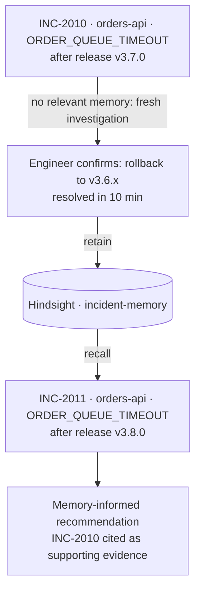
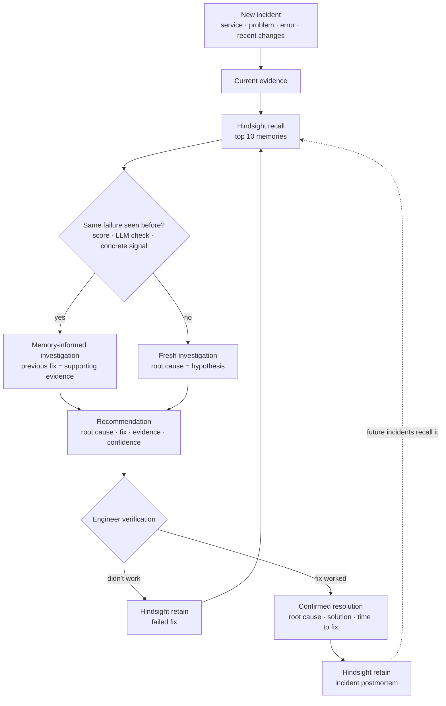
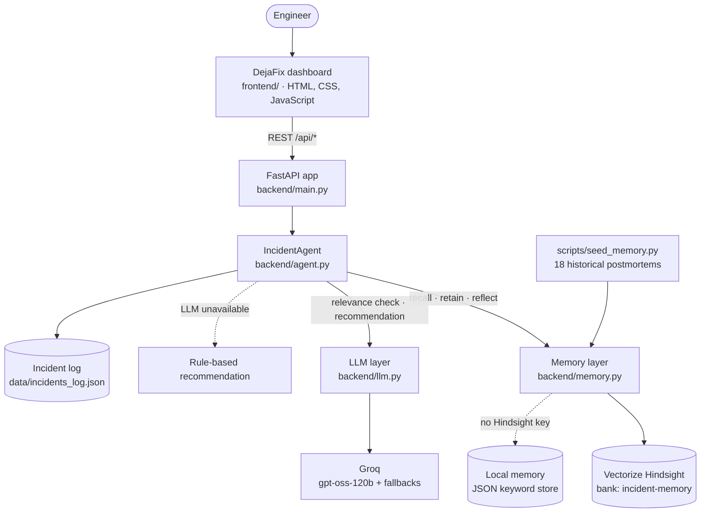

<div align="center">

# DejaFix

**Incident response that remembers every outage**

[](https://www.python.org/)
[](https://fastapi.tiangolo.com/)
[](https://hindsight.vectorize.io/)
[](https://groq.com/)
[](#hackathon-alignment)
[](https://github.com/sathwikgoud28/Hack_with_Hyderabad)

</div>

DejaFix is an AI incident response agent for on-call engineers. It uses **Hindsight** as persistent memory, so every
confirmed incident resolution becomes experience the agent can recall the next time a similar failure appears.
When a problem is new, DejaFix says so, investigates from the current evidence, and learns once an engineer
confirms the fix.

```
Traditional:  Incident → AI → generic troubleshooting

DejaFix:      Incident → current evidence → Hindsight recall → previous engineering experience
                       → AI reasoning → informed recommendation
```

**Contents:** [Problem](#the-problem) · [Solution](#the-solution) · [Why Hindsight](#why-hindsight-is-central) ·
[Memory in action](#hindsight-memory-in-action) · [Known vs new](#known-problem-vs-new-problem) ·
[Features](#key-features) · [How it learns](#how-dejafix-learns) · [Architecture](#architecture) ·
[Tech stack](#technology-stack) · [Structure](#project-structure) · [Demo](#demo-workflow) ·
[Insights](#memory-insights) · [Safety](#safety-and-evidence-policy) · [Security](#security) ·
[Setup](#local-setup) · [Usage](#how-to-use) · [Hackathon](#hackathon-alignment) ·
[Screenshots](#screenshots) · [Roadmap](#future-improvements) · [License](#license) · [Author](#author)

---

## The Problem

When production breaks, the on-call engineer usually starts from zero. The team may have fixed the same failure
weeks ago, but that knowledge sits in an old chat thread, a postmortem nobody reopens, or the memory of someone
who is off shift. Engineers repeat reactions that did not help last time, such as restarting pods or scaling up,
while the outage continues.

A stateless AI assistant does not solve this. It can offer general troubleshooting advice, but it has never seen
*your* incidents, *your* services, or what *your* team confirmed as the fix.

## The Solution

DejaFix gives incident response a memory:

1. The engineer reports an incident: **service, problem, error**, and optionally logs or recent changes.
2. DejaFix asks Hindsight for similar past incidents and checks whether any of them is **the same kind of failure**.
3. **Known problem:** the previous confirmed resolution is shown as supporting evidence for the recommendation.
   **New problem:** DejaFix runs a fresh investigation and labels its root cause as a hypothesis.
4. The engineer applies the fix and reports the outcome. **Only confirmed outcomes are stored in Hindsight.**
5. The next similar incident starts with that experience instead of from zero.

DejaFix recommends; the engineer decides and applies. The application never executes remediation itself.

## Why Hindsight Is Central

Hindsight is the **persistent memory layer** of DejaFix. It is not used as a lookup table: Hindsight extracts facts
from each stored incident, consolidates them into observations, and recalls them by meaning. The result is
persistent **organizational incident memory** that grows with every confirmed resolution.

| Hindsight capability | What DejaFix uses it for |
|---|---|
| **Recall** | Retrieve relevant historical incidents, similar symptoms, previous root causes, successful resolutions, fixes that failed, and previous outcomes (time to fix). |
| **Retain** | Store confirmed incidents: the confirmed root cause, the successful resolution, what did not work, and time-to-fix, plus fixes an engineer reports as failed. |
| **Reflect** | Reason over the whole memory bank to describe recurring patterns, affected services, triggers, working and failing fixes, and preventive actions. |

How it is wired (in [`backend/memory.py`](backend/memory.py) and [`backend/agent.py`](backend/agent.py)):

| SDK call | When | Details |
|---|---|---|
| `create_bank` | first use | Bank `incident-memory` with a mission: remember services, symptoms, errors, root causes, triggers, working fixes, failed fixes, time to resolve. |
| `recall` | every investigation | Top 10 memories for the incident (semantic and keyword retrieval, reranked by Hindsight). |
| `retain_batch` | fix confirmed / fix failed / seeding | Incident postmortem text with real timestamp, `document_id`, `service:<name>` tag and structured metadata (problem, error, root cause, solution, outcome, time to resolve). |
| `reflect` | Memory insights | Analysis of all incidents and failed fixes, requested as six sections. |
| `list_memories` | header, insights | Live memory count and connection status. |
| `delete_bank` | `seed_memory --reset` | Clean slate for a demo. |

The repository ships with **18 synthetic historical postmortems** (fictional company "ShopNest", 10 services) that
`scripts/seed_memory.py` loads into Hindsight, so the agent starts with organizational history.

## Hindsight Memory in Action

This is a recorded run of the learning loop from the project's own testing, using the real `orders-api` scenario.



| | Incident 1: **INC-2010** | Incident 2: **INC-2011** |
|---|---|---|
| Service / error | `orders-api` · `ORDER_QUEUE_TIMEOUT` | `orders-api` · `ORDER_QUEUE_TIMEOUT` |
| Problem | Orders are failing intermittently | Orders are getting stuck in the processing queue |
| Recent change | Release v3.7.0 deployed 8 minutes ago | Release v3.8.0 deployed 15 minutes ago |
| Hindsight recall | No relevant memory | **Recalled INC-2010** |
| Mode | 🆕 Fresh investigation | 🧠 Known problem |
| Recommendation | Likely regression in v3.7.0 (hypothesis, medium confidence) → roll back to v3.6.x | Likely regression in v3.8.0 → roll back, citing INC-2010 as supporting evidence (high confidence) |
| Outcome | **Confirmed** by the engineer: regression in v3.7.0 made queue processing exceed the timeout; rollback to v3.6.x; 10 minutes. Retained in Hindsight. | Presented for engineer verification |

Opening INC-2011 in DejaFix shows the memory it used and the reasons for the match (excerpt from the actual cards):

```text
🧠 MEMORY USED
Previous incident   INC-2010 · orders-api
Previous problem    orders are failing intermittently · ORDER_QUEUE_TIMEOUT
Previous solution   Rollback orders-api to the previous stable version (v3.6.x)
Previous outcome    ✅ Resolved in 10 min

🔍 WHY THIS RECOMMENDATION?
Matching signals    ✓ Same service (orders-api)
                    ✓ Same error (ORDER_QUEUE_TIMEOUT)
                    ✓ Both happened around a deployment / release
                    ✓ Similar symptoms: timeouts, queue processing
```

> **The previous incident is supporting evidence, not proof.** DejaFix did not copy INC-2010's root cause. Its
> likely root cause named the *current* release (v3.8.0), and INC-2010 appeared in the evidence as "showed identical
> pattern after v3.7.0 regression". The engineer still verifies the recommendation against current evidence.

Incident IDs are assigned sequentially from `INC-2001`, so a fresh installation will show different IDs.

## Known Problem vs New Problem

| Situation | DejaFix behavior |
|---|---|
| Similar incident found | Recalls previous experience and shows the **🧠 Memory used** card |
| No relevant memory | Performs a **fresh investigation** and shows the **🆕 New pattern** panel |
| Previous fix succeeded | Uses it as **supporting evidence**, never as automatic proof |
| Root cause unknown | Marks it as a **hypothesis**; confidence is capped at medium |
| Fix fails or is rejected | Retains the failed fix and investigates again, instructing the AI not to repeat it |
| Fix confirmed | Retains the confirmed experience in Hindsight |
| Similar incident occurs later | Retrieves the learned experience |

A recalled incident only counts as the **same problem** when all three checks pass:

1. **Relevance score:** Hindsight's reranked score is above a threshold.
2. **Same failure:** an LLM check confirms it is the same failure mechanism, judging only from what the new
   incident states (it may not assume causes the report does not mention). Without an LLM, the score decides.
3. **Concrete signal:** the same service, the same error code or message, or at least two shared kinds of symptom.

A recalled incident with the same service **and** the same error counts as the same problem even if the LLM check
hesitates on a terse report. Every look-alike that Hindsight returned but that failed these checks is listed in the
UI with the reason, so it is visible that DejaFix retrieves *relevant* memory, not merely *some* memory.

## Key Features

- **Incident investigation** from four fields: service, problem, error, and optional logs / recent changes.
- **🧠 Memory used card** with the previous incident, Hindsight similarity, previous problem, solution and outcome,
  the raw facts Hindsight recalled, and a flow from current incident to current recommendation.
- **🆕 New pattern panel** that states no relevant memory was found and lists what the recommendation is based on.
- **Recommendation** with likely root cause, suggested fix, evidence, what not to do, step-by-step instructions,
  confidence, and estimated time to fix.
- **🔍 Why this recommendation?** Current incident vs previous incident, the matching signals that were actually
  checked, the previous solution and its outcome.
- **Engineer review loop:** ✅ *Fix worked* stores the confirmed resolution; ❌ *Didn't work / Reject* stores the failed
  fix and starts a new investigation that is instructed not to repeat it.
- **Incident timeline** built from real timestamps (detected, investigated, Hindsight searched, recommendation,
  fix outcome, resolved, saved to Hindsight). Missing times are shown as "not recorded", never invented.
- **Active incidents** and **Past incidents** views, and a **Memory insights** page (see below).
- **Hindsight status** in the header: connection state, memory bank, and live memory count.
- **Offline mode:** without keys, a local keyword-scored memory store and rule-based recommendations keep the app
  and tests running.
- **Resilient LLM layer:** retries, tolerant JSON parsing, and a model fallback chain for rate limits.

## How DejaFix Learns



What is written to Hindsight, and when:

| Event | Stored as | Content |
|---|---|---|
| Investigation | *nothing* | Unverified AI output is never retained. |
| Fix reported as not working | `failed_fix` | The fix that was tried, the incident, the error, and the engineer's note. |
| Fix confirmed | `incident_postmortem` | Problem, error and recent changes, **confirmed** root cause, **confirmed** solution, fixes that did not work, time to resolve. |

## Architecture



The FastAPI app serves both the REST API and the static dashboard, so there is one process to run.

| Method | Endpoint | Purpose |
|---|---|---|
| `GET` | `/` | Dashboard |
| `GET` | `/api/health` | Memory backend, bank, memory count, Hindsight connection, LLM model |
| `GET` | `/api/examples` | Example incidents and known service names for the form |
| `POST` | `/api/incidents` | Investigate a new incident |
| `GET` | `/api/incidents?status=investigating\|resolved` | List incidents |
| `GET` | `/api/incidents/{id}` | One incident: attempts, memory used, timeline data |
| `POST` | `/api/incidents/{id}/fail` | Fix did not work: retain failed fix, investigate again |
| `POST` | `/api/incidents/{id}/resolve` | Fix worked: retain the confirmed resolution |
| `GET` | `/api/history` | Resolved incidents plus historical postmortems |
| `GET` | `/api/insights/summary` | Insight cards, patterns, learning progression (no LLM) |
| `GET` | `/api/insights` | Hindsight `reflect` analysis |
| `POST` | `/api/admin/seed?reset=true` | Load (and optionally reset) the memory bank |

Reliability details:
- **LLM errors:** retries with backoff; JSON mode is dropped on the final attempt; a rate limit (HTTP 429) switches to
  the next model immediately, and if every model is limited DejaFix waits up to 15 seconds and retries once.
- **Validation:** recommendations are validated with Pydantic; invalid output falls back to the rule-based path.
- **Visible memory failures:** a failed recall shows a "Hindsight recall failed" banner instead of silently answering
  without memory; a failed memory write keeps the incident open (HTTP 502).
- **Thread safety:** all Hindsight SDK calls run on one dedicated worker thread.

## Technology Stack

| Component | Technology |
|---|---|
| Frontend | HTML, CSS and vanilla JavaScript (no framework, no build step), served by FastAPI |
| Backend | Python 3.11+ (developed on 3.13), FastAPI, Uvicorn, Pydantic v2 |
| Persistent memory | Vectorize Hindsight Cloud via the `hindsight-client` Python SDK |
| AI model | Groq: `openai/gpt-oss-120b`, falling back to `qwen/qwen3.8-27b` and `openai/gpt-oss-20b` (configurable) |
| Incident records | JSON file (`data/incidents_log.json`); no database |
| Configuration | Environment variables / `.env` via `python-dotenv` |
| Testing | pytest and FastAPI `TestClient` (httpx): 31 offline tests with a fake LLM and local memory |
| Deployment | Not deployed; runs locally with Uvicorn |
| Version control | Git + GitHub |

## Project Structure

```text
Hack_with_Hyderabad/
├── backend/
│   ├── __init__.py
│   ├── main.py              FastAPI app: REST API and static dashboard
│   ├── agent.py             IncidentAgent: recall → relevance checks → recommendation → retain; insights
│   ├── memory.py            Hindsight SDK wrapper, plus the offline LocalMemory store
│   ├── llm.py               Groq client: retries, model fallback, tolerant JSON parsing
│   ├── models.py            Pydantic request and response schemas
│   └── config.py            Settings loaded from environment variables / .env
├── frontend/
│   ├── index.html           Dashboard layout (New incident, Active, Past, Memory insights)
│   ├── app.js               UI logic and rendering
│   └── style.css            Dark SRE dashboard theme
├── data/
│   ├── seed_incidents.json  18 synthetic historical postmortems loaded into Hindsight
│   └── demo_alerts.json     Example incidents for the form
├── scripts/
│   ├── __init__.py
│   └── seed_memory.py       Load or reset the Hindsight memory bank
├── tests/
│   ├── __init__.py
│   └── test_agent.py        Offline test suite
├── docs/
│   └── PHASES.md            Development log, phase by phase
├── .env.example             Configuration template (placeholders only)
├── .gitattributes
├── .gitignore
├── requirements.txt
└── README.md
```

Not in the repository (git-ignored): `.env` (you create it from `.env.example`), `data/incidents_log.json`
(incidents on this machine, created at runtime) and `data/local_memory.json` (created in offline mode only).

## Demo Workflow

This is the core proof that the agent learns. The seeded history has no `orders-api` incidents, so after
`python -m scripts.seed_memory --reset` the first incident below is expected to start as a new problem, as in the
recorded run.

| Step | Action | What to look for |
|---|---|---|
| 1 | Open `http://localhost:8000` | Header shows **Hindsight connected** and the memory count |
| 2 | Investigate: service `orders-api`, problem `Orders are failing intermittently`, error `ORDER_QUEUE_TIMEOUT`, recent changes `Release v3.7.0 was deployed 8 minutes ago. Order queue processing time has increased significantly.` | Progress: searching Hindsight, checking relevance, generating the recommendation |
| 3 | Hindsight finds no previous memory | **NEW PROBLEM · 🆕 No relevant memory found** |
| 4 | DejaFix performs a fresh investigation | Root cause tagged **Hypothesis · not yet confirmed** |
| 5 | Click **✅ Fix worked**; confirm root cause `Regression in v3.7.0 causing order queue processing to exceed the configured timeout`, solution `Rollback orders-api to the previous stable version (v3.6.x)`, minutes `10` | The form is pre-filled with the AI's suggestion; edit it to what was actually confirmed |
| 6 | Hindsight stores the incident | **🧠 Hindsight learned a new memory** card; timeline shows *Outcome saved to Hindsight* |
| 7 | Investigate a similar incident: same service and error, problem `Orders are getting stuck in the processing queue`, recent changes `Release v3.8.0 was deployed 15 minutes ago. Order queue processing time has increased again.` | Same progress steps; this time Hindsight returns the incident from step 6 |
| 8 | Hindsight retrieves the previous experience | **KNOWN PROBLEM · 🧠 Hindsight memory found** and the **🧠 Memory used** card |
| 9 | DejaFix produces a memory-informed recommendation | Previous solution cited as supporting evidence |
| 10 | Show why the recommendation was generated | **🔍 Why this recommendation?**: matching signals, previous solution and outcome |

Optional: click **❌ Didn't work / Reject** on a fresh incident to show that failed fixes are remembered too, and
investigate `auth-api` / `Users cannot log in` / `OAUTH_TOKEN_INVALID` to show that an unrelated incident does not
reuse the `orders-api` memory. Recommendation wording comes from an LLM and varies between runs; the memory
decision and the recalled incident are the parts to watch.

## Memory Insights

The **Memory insights** tab summarizes what DejaFix has learned. The cards, the learning progression and the pattern
sections are computed from real data without an LLM; preventive actions come from Hindsight reflect.

- **Summary cards:** total memories in Hindsight, resolved incidents, recurring patterns (and how many incidents were
  recognized from memory), and new problems learned (unknown → confirmed fix → memory).
- **Learning progression:** the newest real pair of incidents where a problem that was new was later recalled.
- **Recurring incident patterns**, **most affected services**, **common triggers** (as recorded in postmortems),
  **successful fixes**, and **failed fixes / ineffective responses** (for example, how often restarting did not help).
- **Hindsight reflect:** on demand, Hindsight reasons over the whole bank and answers in six sections: recurring
  patterns, affected services, triggers, successful fixes, failed fixes, and preventive actions.

## Safety and Evidence Policy

DejaFix separates **evidence**, **hypothesis**, **historical memory** and **confirmed resolution**.

| Principle | How DejaFix applies it |
|---|---|
| Historical similarity is not proof | A memory-based root cause is labeled *From memory · confirmed in INC-xxxx* with a reminder to check that current evidence matches. A previous root cause is never presented as the confirmed current root cause. |
| AI recommendations are hypotheses until verified | For new problems the root cause is phrased as "Possible …, based on …", tagged *Hypothesis · not yet confirmed*, with a ⚠️ confirmation warning; confidence is capped at medium. |
| Current evidence verifies recommendations | Recommendations list evidence from the current incident; the engineer confirms the actual root cause and solution before anything is stored. |
| No fabricated history | In a fresh investigation any claimed past incidents are removed. The memory card only shows incidents Hindsight actually returned and the relevance checks accepted. |
| Unknown information remains unknown | Unknown root causes stay "Unknown"; missing timestamps are shown as "not recorded". |
| Only confirmed outcomes become durable memory | Investigations store nothing. Hindsight receives an engineer-confirmed resolution, or a fix the engineer reported as not working. |
| Failed fixes are not discarded | They are retained in Hindsight, shown on the incident as ❌ attempts that did not work, and passed to the next investigation with an instruction not to repeat them. |
| No autonomous remediation | DejaFix never runs commands or changes systems; engineers apply fixes. |

Scores are aids, not guarantees: *confidence* is the model's own assessment and *similarity* is Hindsight's semantic
similarity. Neither is a calibrated probability that a recommendation is correct.

## Security

- API keys are read from environment variables (`.env`, loaded by `python-dotenv`); nothing is hardcoded.
- `.env` and `.env.*` are git-ignored; only `.env.example`, which contains placeholders, is committed.
- No production secrets belong in this repository.
- The bundled demo data is synthetic (fictional company and people); it contains no real customer information.
- Incident text is sent to Groq (LLM) and Hindsight Cloud (memory). Do not paste secrets or personal data into
  incident fields.
- This is a hackathon prototype, **not production-ready**: the dashboard and API have **no authentication**
  (including `POST /api/admin/seed?reset=true`, which can wipe the memory bank). Run it locally only.

## Local Setup

**Requirements:** Python 3.11+, a [Hindsight Cloud](https://ui.hindsight.vectorize.io) API key and a
[Groq](https://console.groq.com) API key. Without keys the app still runs in offline mode.

**1. Clone the repository**

```bash
git clone https://github.com/sathwikgoud28/Hack_with_Hyderabad.git
cd Hack_with_Hyderabad
```

**2. Install dependencies**

```bash
python -m venv .venv
.venv\Scripts\activate            # Windows
source .venv/bin/activate         # macOS / Linux
pip install -r requirements.txt
```

**3. Configure `.env`**

```bash
copy .env.example .env            # Windows
cp .env.example .env              # macOS / Linux
```

| Variable | Purpose | Default |
|---|---|---|
| `HINDSIGHT_API_KEY` | Hindsight Cloud API key | *(empty: offline memory)* |
| `HINDSIGHT_BASE_URL` | Hindsight API endpoint | `https://api.hindsight.vectorize.io` |
| `HINDSIGHT_BANK_ID` | Memory bank name | `incident-memory` |
| `GROQ_API_KEY` | Groq API key | *(empty: rule-based recommendations)* |
| `GROQ_MODEL` | Primary model | `openai/gpt-oss-120b` |
| `GROQ_FALLBACK_MODEL` | Comma-separated fallback models | `qwen/qwen3.8-27b,openai/gpt-oss-20b` |
| `MEMORY_BACKEND` | `auto`, `hindsight` or `local` | `auto` |

**4. Load the historical incidents into Hindsight** (with the app stopped, so it cannot write old incidents back)

```bash
python -m scripts.seed_memory --reset    # resets the memory bank and this machine's incident log
```

**5. Start the application** (the backend also serves the frontend; there is no separate frontend server)

```bash
uvicorn backend.main:app --port 8000
```

**6. Open** [http://localhost:8000](http://localhost:8000)

**Run the tests** (offline, no keys needed):

```bash
$env:MEMORY_BACKEND="local"; python -m pytest -q     # Windows PowerShell
MEMORY_BACKEND=local python -m pytest -q             # macOS / Linux
```

## How to Use

1. **Report an incident** on the *New incident* tab: service, problem, error, and optionally logs / recent changes.
   The *Try an example* buttons fill the form.
2. Press **🔍 Investigate**. The banner shows whether this is a **known problem** (Hindsight memory found) or a
   **new problem** (no relevant memory).
3. Read the **memory card** or **new pattern** panel, the **recommendation**, and **Why this recommendation?**
4. Apply the fix yourself, then report the outcome:
   - **✅ Fix worked:** confirm the root cause, the solution and (optionally) minutes to fix. The confirmed resolution
     is saved to Hindsight.
   - **❌ Didn't work / Reject:** add an optional note. The failed fix is saved and DejaFix investigates again.
5. **Active incidents** lists open incidents; click one to continue. **Past incidents** lists historical and learned
   resolutions. **Memory insights** shows what the memory contains; press **Run Hindsight reflect** for an analysis.
6. Direct links: `/#incident=INC-2011` opens an incident, `/#tab=insights` opens a tab.

## Hackathon Alignment

Built for **HackwithHyderabad 3.0**, theme **"AI Agents That Learn Using Hindsight"**.

| Criterion | How DejaFix addresses it |
|---|---|
| Innovation | Persistent memory applied to software incident response: past engineering experience becomes evidence for new incidents. |
| Use of Hindsight memory | Hindsight is central: recall on every investigation, retain of confirmed resolutions and failed fixes, reflect for insights. The known-vs-new decision is driven by what Hindsight returns. |
| Technical implementation | Working integration of investigation, relevance checks, LLM reasoning and persistent memory, with a fallback chain, offline mode and an automated test suite. |
| User experience | An engineer-focused dashboard that shows which memory was used, why, and what is still a hypothesis. |
| Real-world impact | Makes previous incident experience available during the next incident, including which reactions did not help. |

## Screenshots

No screenshots are committed yet. The table lists the planned captures and suggested file names under
`docs/screenshots/`; image links will be added once the files exist.

| Screen | What it should show | Suggested file |
|---|---|---|
| Dashboard | Header with Hindsight status, tabs, *Why Hindsight?* panel | `docs/screenshots/dashboard.png` |
| New incident | Incident form and the 🆕 **New pattern** result | `docs/screenshots/new-incident.png` |
| Hindsight memory used | 🧠 **Memory used** card and the recall flow | `docs/screenshots/memory-used.png` |
| Why this recommendation? | Matching signals, previous solution and outcome | `docs/screenshots/why-recommendation.png` |
| Past incidents | Historical and learned resolutions | `docs/screenshots/past-incidents.png` |
| Memory insights | Summary cards, learning progression, insight sections | `docs/screenshots/memory-insights.png` |

## Future Improvements

The following are **not implemented**; they are possible next steps.

- Slack, Jira and PagerDuty integrations
- GitHub deployment-event integration to link incidents to releases automatically
- Automated log ingestion
- Service-specific memory filtering
- Memory relevance visualization
- Detection of conflicting historical evidence
- Post-mortem generation
- Runbook recommendations
- Incident analytics over time
- Team authentication and access control

## License

No license file has been added yet. Until one is added, the code is not licensed for reuse by default. Add a
`LICENSE` file (for example MIT) if you intend the project to be open source.

## Author

**Sathwik**: [@sathwikgoud28](https://github.com/sathwikgoud28)

Built for HackwithHyderabad 3.0 with [Vectorize Hindsight](https://hindsight.vectorize.io/) and
[Groq](https://groq.com/).
